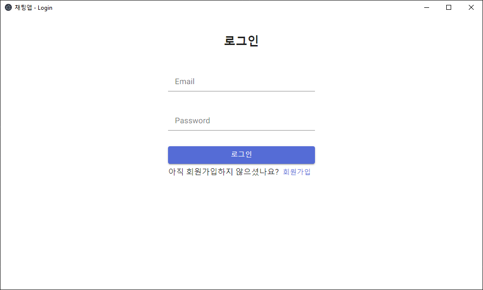

# Nextron 채팅 앱

Nextron(Electron + Next.js)와 firebase를 이용한 채팅 앱

## 작업 기간

2023.1.11 ~ 2023.1.18

## 기술 스택

React, Typescript, MUI, Nextron, firebase, git

## 기능

1. 회원가입
2. 로그인
3. 유저 목록
4. 1:1 채팅
5. 그룹 채팅

## 실행 방법

1. 레포지토리를 내려받는다.
2. `renderer/lib/firebase/app.ts` 파일에 환경 변수 입력

   ```js
   // renderer/lib/firebase/app.ts

   const firebaseConfig = {
     apiKey: "",
     authDomain: "",
     projectId: "",
     storageBucket: "",
     messagingSenderId: "",
     appId: "",
   };
   ```

   또는 환경변수 추가

   ```
   API_KEY=
   AUTH_DOMAIN=
   PROJECT_ID=
   STORAGE_BUCKET=
   MESSAGING_SENDER_ID=
   APP_ID=
   ```

3. 패키지 설치

   ```
   $ yarn
   ```

4. 빌드

   ```
   // 윈도우
   $ yarn build --win --x64
   // 맥
   $ yarn build --mac --x64

   ```

5. `dist` 폴더에서 설치 파일 실행

---

## 실행 화면

### 로그인 화면

- 로그인할 수 있다.



### 회원가입 화면

- 회원가입할 수 있다.


### 홈 화면

- 홈 화면
- 우측 상단 메뉴 버튼을 클릭하면 메뉴가 펼쳐진다.
- 뒤로가기 버튼을 클릭하면 이전 화면으로 이동할 수 있다. (단, 로그인을 했을 경우 로그인 화면으로 이동 불가)
- `단체 채팅방` 클릭 시 모든 유저가 참여한 채팅방에 입장할 수 있다.


### 메뉴 화면

- 다른 페이지로 이동할 수 있다.
- `Sign out` 버튼을 클릭하면 로그이웃을 할 수 있다.


### 1:1 채팅 (Direct Message) 화면

- 내가 참여한 1:1 채팅 목록을 확인할 수 있다.
- 채팅 목록 중 하나를 클릭하면 채팅방으로 이동할 수 있다.


### 그룹 채팅 (Group Chat) 화면

- 그룹 채팅방을 생성할 수 있다.
- 내가 참여한 그룹 채팅 목록을 확인할 수 있다.
- 유저의 이메일을 입력한 후 `인원 추가하기` 클릭 시 채팅방에 참여할 인원을 추가할 수 있다.


### 채팅방 (Chat Room) 화면

- 채팅 메세지를 확인할 수 있다.
- 메세지를 입력하고 `SEND` 클릭 시 채팅 메세지를 보낼 수 있다.


### 유저 목록 (Members) 화면

- 회원가입한 유저들을 확인할 수 있다.
- `1:1 채팅` 버튼 클릭 시 1:1 채팅을 시작할 수 있다.


---

### 회고

1. Electron

Electron을 처음 접한 프로젝트였고, Main 스레드를 이용한 구조가 재미있었다. 해당 토이 프로젝트를 통해 데스크탑 앱을 처음 구현해본 좋은 경험이었다. 브라우저와 조금 다르게 alert와 같이 Main 스레드를 막는 Web api를 사용하지 못한다는 차이가 흥미로웠다.

초기 통신은 main 스레드를 이용하여 비동기 서버 통신을 이용하려고 했으나 ipc 특성을 공부하기에 시간이 촉박했고, 안전성 및 보안(컴퓨터 fs 접근 권한 등)에 대해 확신하지 못했기 때문에 클라이언트에서 firebase와 직접 통신하기로 결정했다. 추후 이 ipc를 Main/Renderer간의 통신에 어떻게 활용할 수 있는지 공부해보고 싶다.

2. Firebase

firebase/auth로 인증/인가를 구현했다. 처음에는 Main 스레드에서 firebase-admin을 통해 유저를 관리하고 싶었지만 낮은 보안성을 우려하여 firestore로 유저를 관리하였다. 유저는 본래 id로 관리해야하지만 실제 구현에서는 편의상 unique한 값인 email을 id 대신 사용하였다.

채팅은 firebase의 실시간 통신을 사용했다. 해당 기능을 처음 사용해보았는데 웹소켓 통신의 구현없이 간편하게 사용할 수 있었다. 빠르게 프로토타입을 구현할 때 편리하게 사용할 수 있을 것 같다.

3. Next.js

Next.js 프로젝트를 사용한 경험이 있기 때문에 서버를 이용한 렌더링을 시도하고 싶었지만 Nextron이 빌드를 해야하기 때문에 Nextjs의 서버를 지원하지 않고(static), 해당 api 기능 역시 사용할 수 없었기 때문에 그 점은 아쉬웠다.

파일 시스템을 토대로한 라우팅이 편리했다.

4. Typescript

타입스크립트는 평소 많이 사용하는데 초기 프로젝트 생성 이후 eslint 설정을 하지 않아 이곳 저곳 타입 작성을 빠뜨리는 참사가 있었다. 프로젝트 세팅에서 linter의 소중함을 알게 되는 좋은 계기였다.
